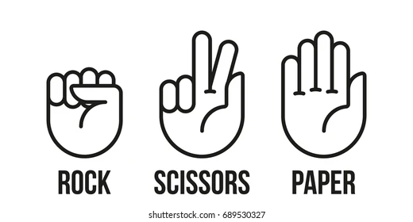
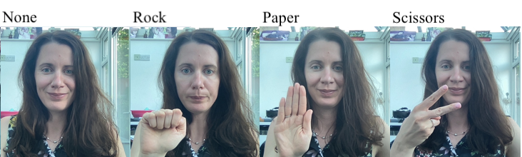
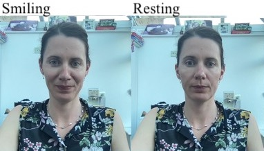
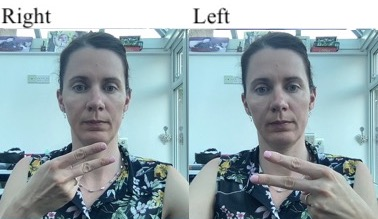
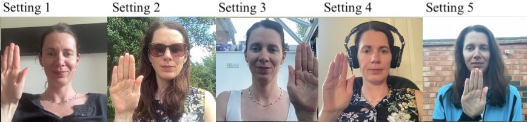
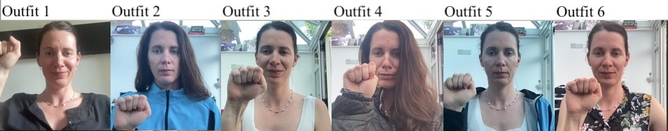
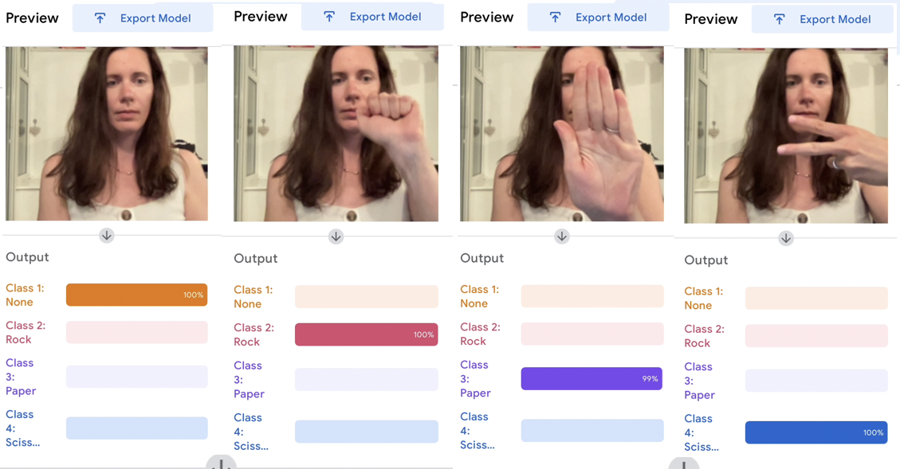
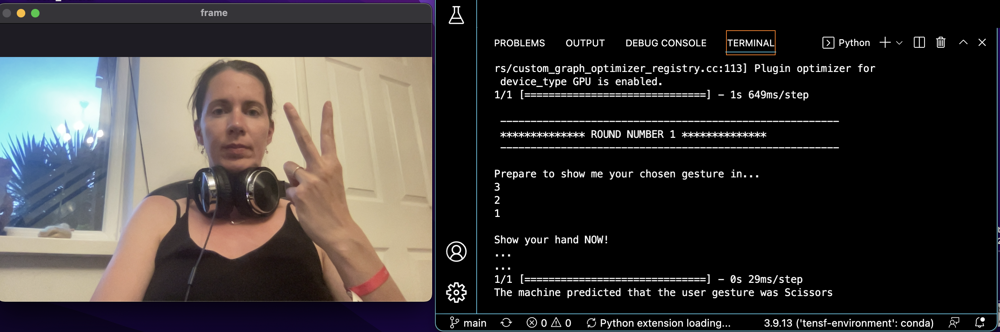

# Computer Vision (AiCore training): Rock, Paper, Scissors!

[](https://www.python.org/)
[](https://github.com/Naereen/StrapDown.js/blob/master/LICENSE)
[](https://bitbucket.org/lbesson/ansi-colors)

Computer vision project that I worked on as part of my 'AI and Data Engineering' training at [AiCore](https://www.theaicore.com/).


## Overview of the project

Rock-Paper-Scissors is a game in which each player simultaneously shows one of three hand signals representing rock, paper, or scissors. Rock beats scissors. Scissors beats paper. Paper beats rock. The player who shows the first option that beats the other player's option wins. This is an implementation of an interactive "Rock Paper Scissors" game in which the user can play with the computer using the camera.

## Learning objectives

The project's main learning objectives were the creation of a (small) image database for computer vision tasks, the set up of virtual environments and the installation of all required packages, and the practice of intermediate Python programming - especially 'if-else' statement, 'while' loops, and object oriented programming.

## Languages and tools
<p align="left"> <a href="https://www.python.org" target="_blank" rel="noreferrer">  </a> <a href="https://www.tensorflow.org" target="_blank" rel="noreferrer">  </a> <a href="https://opencv.org/" target="_blank" rel="noreferrer">  </a> <a href="https://git-scm.com/" target="_blank" rel="noreferrer">  </a> </p>

The project was created using the industry-standard editor VS Studio Code, and Git and GitHub were used throughout.

## Project structure

The project comprises of four milestones organised as follows:

1 - MILESTONE 1: Creation of the model.
- creation of the dataset to be used to train the model used in the programme;
- creation of the model using [Teachable Machine](https://teachablemachine.withgoogle.com/).

2 - MILESTONE 2: Installation of the dependencies.
- creation of a new virtual environment;
- model testing on the local machine.

3 - MILESTONE 3: Creation of a 'Rock, Paper, Scissors' game (`manual_rps.py`).
- store the user's and the computer's choices;
- figure out who won;
- create a function to simulate the game.

4 - MILESTONE 4: Using the camera to play the game (`camera_rps.py`).
- set up the camera and test the game;
- bonus implementations.

# Creation of the model

The creation of this computer vision application requires setting up a dataset to be used to train a model that recognises four different hand gestures: 1: Rock; 2- Paper; 3- Scissors; 4- None.

None is the lack of any gesture, while the first three gestures are those commonly used during the game of 'Rock, Paper, Scissors'. These are as in the image below.

<p align="center">

</p>

Four representative pictures taken from the training images are provided below.

<p>

</p>

The creation of the dataset is followed by the training and creation of the model. These are done on [Teachable Machine](https://teachablemachine.withgoogle.com/), as I discuss in what follows.

## Creation of the dataset

The project required that the pictures used to train the model were half-bust shots of only one person, myself in this case. The creation of the pictures was done so as to limit overfitting, a common concern of all machine learning projects. 

While overfitting cannot be completely avoided in a model trained on images of only one person (the model is likely to perform poorly with users different from the one in the training images), it is possible to limit situations in which the model overfits because of a simple change of setting or outfit by varying the input images as much as possible.

To do so, the created images varied along the following axes (representative pictures are provided for reference):

- hair do (hair up, hair down, headphones)


- facial expression (resting vs. smiling face)


- hand (right vs. left, note that the camera inverses the images)


- setting (for a total of 5)


- outfit (for a total of 6)



- locus where the gesture is realised (all over the screen, both over the person's body and on the side - see miscellaneous pictures above).

Once the dataset was ready, the images were uploaded to the Teachable Machine website. Using Teachable Machine is quite straightforward: classes are created on the left colums, the images are easily (and rapidly!) uploaded in the right class folder from the local machine or a cloud, the training is launched by clicking on a button in the middle colum, and then the output can be tested on the right colum. All these can be seen in the screenshot below:

<p align="center">

</p>

At the end of the training, the model can be exported using the 'export model' button on the upper right of the webpage. This creates two files, `keras_model.h5` (the model itself) and `labels.txt` (the file containing the labels). These files contain the structure and the parameters of our deep learning model, but they are not files that can be run, and do not contain anything readable. Nonetheless, they will be central to our the computer vision programme.

## Output accuracy

A first model trained on less than 300 images turned out to be very deceiving, and almost completely unable to distinguish both 'Rock' and 'Paper' gestures. A second dataset was thus created, which included a total of 1007 images. The model now performes in a satisfactory way; images from the testing phase are prodided below:



## Biases and limitations

The dataset was created as such that its performance in only guarantee if I am the user: the output will likely be unsatisfactory if people of other genders, ethnicities, or with special outfits and accessories use the model in a computer vision application. 

Despite this, I would nonetheless recommend the metodology for the creation of small datasets for machine learning models outlined above to those who are interested in engaging in small-scale learning projects, as a maximally varied dataset is a good way to reduce overfitting problems.

# Virtual environment setup

The project included the creation of a virtual environment, and the installation of all required dependencies (`tensorflow`, `opencv`, `ipykernel`). 

Tensorflow is notoriously hard to install in MacBooks with the M1 chip, like mine, therefore the task was quite frustrating and time-consuming. For those who might face the same problem, I recommend making sure your operating system is up-to-date, downloading the file at this [link](https://github.com/conda-forge/miniforge/releases/latest/download/Miniforge3-MacOSX-arm64.sh) and then following the following steps:

```python
# create the environment
# python=3.9 is needed for compatibility reasons
# new_env is the name of your new environment 
conda create -n new-env python=3.9
# activate the environment
conda activate new-env
# install pip
conda install pip
# give executable permissions to the file you downloaded
chmod +x ~/Downloads/Miniforge3-MacOSX-arm64.sh
# execute the file you downloaded
sh ~/Downloads/Miniforge3-MacOSX-arm64.sh
# if your virtual environment changed, make sure you activate it: conda activate new-env
# activate miniforge3 
source ~/miniforge3/bin/activate
# if your virtual environment changed, make sure you activate it: conda activate new-env
# install tensorflow
conda install -c apple tensorflow-deps
# install the required dependencies for Mac
python -m pip install tensorflow-macos
# install the metal plugin
python -m pip install tensorflow-metal
```

Our environment additionally contained `opencv` (which allows to use the camera) and `ipykernel`, which allows to use Jupyter Notebooks. All requirements are in the `requirements.txt` file.

# Creation of the manual version

The `manual_rps.py` file contains a first version of the code which checks the basic logic behind it manually. The file is created using OOP principles, and is therefore organised around a class, `Game()`. The features of the class are the following, as indicated in the `docstring`:

1- Parameters:
- `gesture_list`: list of gestures to be used in the game;

2- Attributes:
- `computer_choice`: string, the gesture to be played by the computer, picked randomly from `gesture_list`;
- `user_choice`: str, the gesture played by the user (input)
- `winner`: str, the winner of the match/game

3- Methods:
- `get_computer_choice(computer_choice)`: gets the computer's input;
- `get_user_choice(user_choice)`: gets the user's input;
- `get_winner(computer_choice, user_choice, winner)`: returns the name of the winner.

The basic logic of the game is contained within the `get_winner()` method, which utilises a series of nested if-else statements to determine the winner. The statements resembles the following one, which checks whether the input by the user and the computer is the same and, if not, checks whether the computer's input is "Rock", and then acts accordignly.

```python
if computer_choice == user_choice:
    print(f"The computer too chose {computer_choice}. No one wins this match!")
elif computer_choice == "Rock":
    if user_choice == "Paper":
        winner = user
        print(f"The computer chose {computer_choice}. The user wins this match!")
    elif user_choice == "Scissors":
        winner = computer
        print(f"The computer chose {computer_choice}. The computer wins this match!")
```

The method `get_winner()` returns the name of the winner.

# Creation of the camera version

The camera version of the application gets the user choice using a webcam. The user is thus prompted to show a hand gesture to the camera, and the machine utilises `keras_model.h5` to guess the gesture and play the game accordingly.

## From `get_user_choice()` to `get_prediction()`

In the manual version of the application, `get_user_choice` was a very simple method which utilised the `input()` function of the `user_choice` attribute to obtain a textual prompt from the user, i.e., the chosen gesture:

```python
def get_user_choice(self, user_choice):
    return user_choice
```
The camera version is more complex and features three different methods that replace `get_user_choice()`:
- `get_camera()`, which turns on the camera used to play;
- `get_prediction()`, which understands the user's input using `keras_model.h5` and probability;
- `classify_output`, which uses the list of probabilities from `get_prediction()` to determine the image inputted in the camera.

## Additional methods and their fonctionalities

The execution of the methods above is further controlled using two timer methods: `countdown_counter()` and `counter_spacer()`. The former slows down the machine to make the programme user-friendly *and* asks the user to prepare to show their hand, while the latter merely slows down the programme and prints two rows of full stops when needed. The effects of these can be seen in the image below.

  

## Improvements in the overall structure

The code was refactored and all methods now have meaningful names. Unnecessary comments and lines of code were deleted. Additionally, a new `docstring` was added, and prints were added to guide the user during the experience (see, for instance, the 'round number' message in the image above).

# Bonus features

I shall be posting a video presentation of the project on my [YouTube channel](https://www.youtube.com/channel/UCSV7T-Axt_hqe6rV_7T-KUg/videos) shortly.