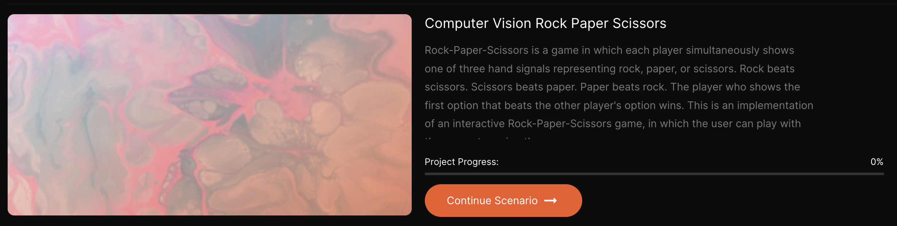

# Computer Vision (AiCore training): Rock, Paper, Scissors!

Computer vision project that I am working on as part of my 'AI and Data Engineering' training at [AiCore](https://www.theaicore.com/).

> Rock-Paper-Scissors is a game in which each player simultaneously shows one of three hand signals representing rock, paper, or scissors. Rock beats scissors. Scissors beats paper. Paper beats rock. The player who shows the first option that beats the other player's option wins. This is an implementation of an interactive "Rock Paper Scissors" game in which the user can play with the computer using the camera.

# Project structure

The project comprises of four milestones organised as follows:

1 - MILESTONE 1: Creation of the model.
- creation of the dataset to be used to train the model used in the programme;
- creation of the model using [Teachable Machine](https://teachablemachine.withgoogle.com/).

2 - MILESTONE 2: Installation of the dependencies.
- creation of a new virtual environment;
- model testing on the local machine.

3 - MILESTONE 3: Creation of a 'Rock, Paper, Scissors' game.
- store the user's and the computer's choices;
- figure out who won;
- create a function to simulate the game.

4 - MILESTONE 4: Using the camera to play the game.
- set up the camera and test the game;
- bonus implementations.

# Creation of the model

## Creation of the dataset

## Output accuracy

## Biases and limitations